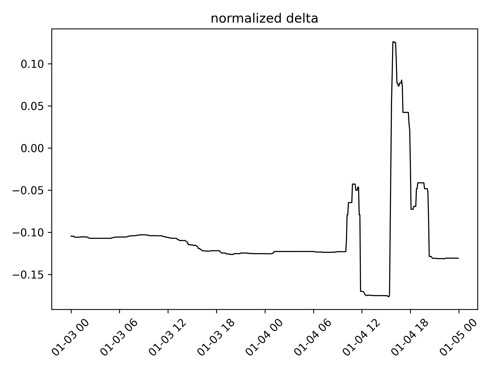
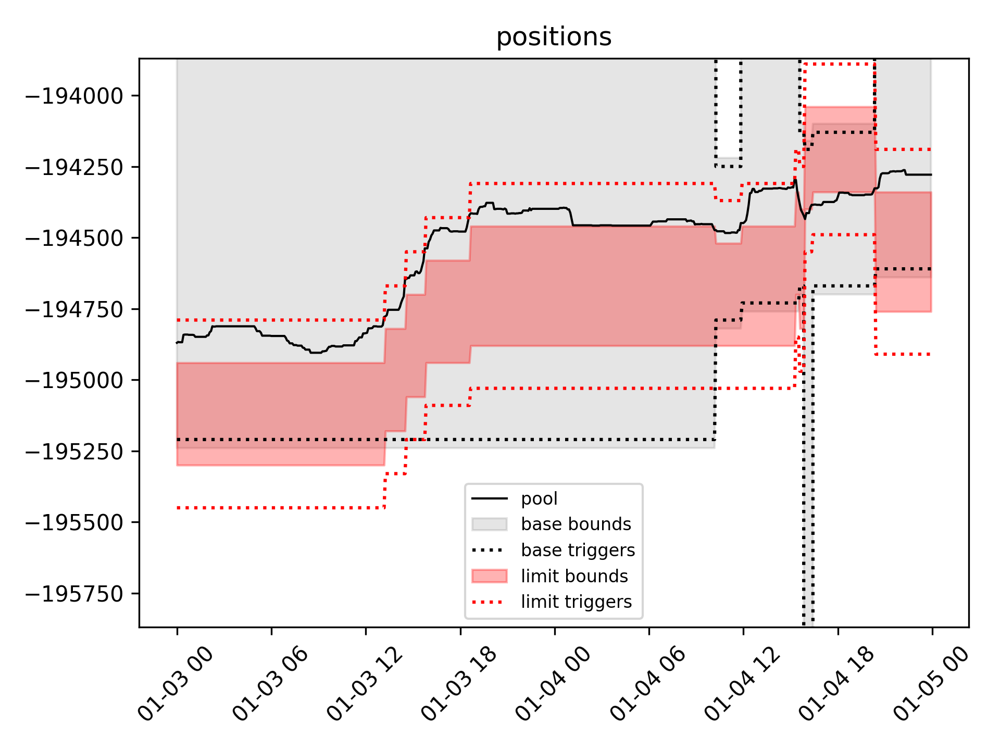
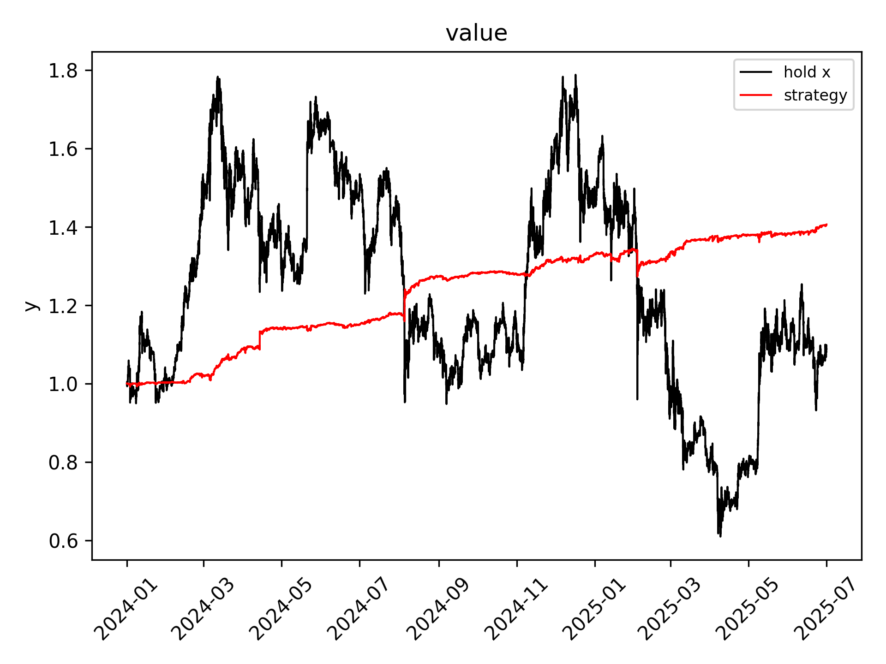
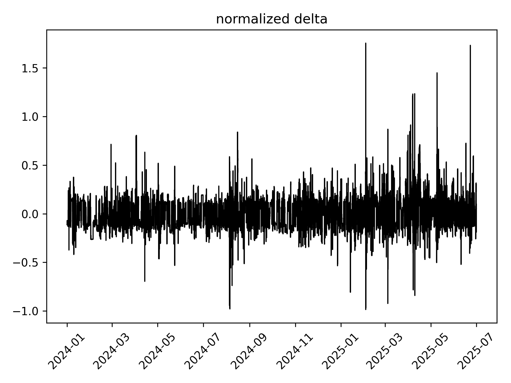
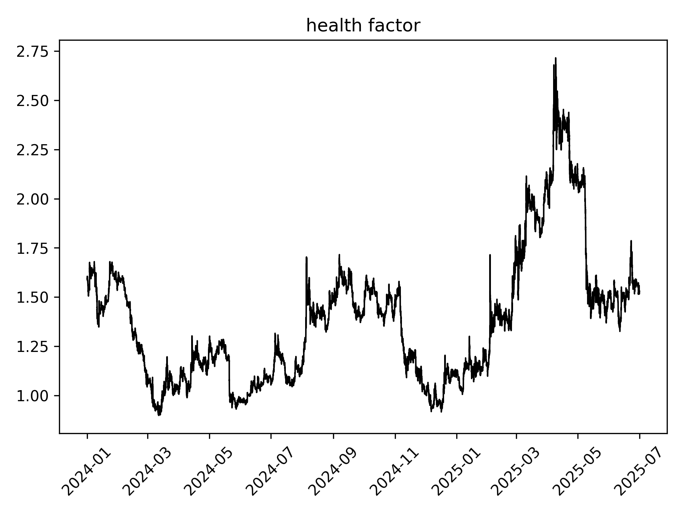

# Backtesting a delta-neutral market-making strategy

## 1. Target strategy on EulerSwap

This strategy is designed for **EulerSwap**, a novel AMM protocol that integrates lending and swapping into a unified architecture. The core goal is to remain **delta-neutral** while capturing fees from market-making activity, by dynamically adjusting the liquidity curve.

### 🧩 Core mechanism

- The market-maker **wants exposure to token Y only** (typically a stablecoin like USDC, USDT, DAI, etc.)
- They **lend token Y** on Euler (earning interest) and **borrow token X** (a volatile asset like ETH, BTC, UNI, etc.)
- Both tokens are used to install a **liquidity curve** on EulerSwap

At initialization, the delta in token X is neutral:

- **Long X** via the tokens X in the curve (assets) 
- **Short X** via the tokens X borrowed (liabilities)

### 🛡️ Modes

As swaps are routed to the curve, the delta (normalized by liabilities) can get away from 0. When this distance exceeds a threshold, the **neutralization mode** is activated:

- The current curve is **uninstalled**
- A new curve is installed with:
  - Equilibrium price reset to current market price
  - **Asymmetric extreme concentrations**:
    - One side with very **high** concentration (flat, low slippage)
    - One side with very **low** concentration (steep, high slippage)
- This acts as a **liquidity filter**: only swaps that neutralize the delta are routed through this curve

When the normalized delta gets back within the threshold, the **cruise mode** is reactivated and the curve is reinstalled, with an equilibrium price reset to current market price and symmetric moderate concentrations.

### 📉 Price-driven rebalance

When the price gets too far away from the equilibrium price, a rebalance is triggered and the curve is reinstalled, with an equilibrium price reset to current market price and concentrations based on the current mode (neutralization or cruise).

## 2. Proxy strategy on Uniswap v3

Despite the relative simplicity of the strategy presented above, it is currently **impossible to empirically backtest it on EulerSwap** due to:

- 📉 **Lack of historical data**  
EulerSwap is still in its early stages, so historical data on volume and liquidity is too limited if not unavailable.

- 🧠 **Proprietary routing logic**  
Every market maker sets its own curve. The router decides which curve to swap against based on slippage, which is quite hard to simulate even with access to the router’s internal logic.

To validate the strategy, we created a **proxy version on Uniswap v3** that replicates its logic, and is **more easily backtestable** thanks to Uniswap v3's historical data and mutual pool liquidity structure.

Since Uniswap v3 is fundamentaly different than EulerSwap, the following **equivalences** were considered:

|Element | EulerSwap           | Uniswap v3        |
|------------------|------------------|--------------|
| Liquidity structure | Individual curve           | Mutual pool       |
| Liquidity form       | Curve       | Positions (plural because there is one for leftovers)   |
| Add liquidity       | Install the curve | Mint positions    |
| Remove liquidity       | Uninstall the curve | Burn positions     |
| Maximum concentration / minimum slippage       | Concentration = 1   | Single-range position       |
| Minimum concentration / maximum slippage       | Concentration = 0     | Full-range position       |

The **backtesting script** (backtest.py) uses a **tailored dataset** (swaps.csv) containing the historical swap data of a given pool, including the liquidity in the current range at each swap. These datasets are generated using proprietary data and script.

Backtesting this proxy strategy allows us to indirectly and approximately backtest the target strategy.

## 3. Results

### 💧 Pool

- **Network**: Polygon  
- **Address**: 0x4ccd010148379ea531d6c587cfdd60180196f9b1
- **Token X**: WETH
- **Token Y**: USDT
- **Fee**: 0.3%
- **Spacing**: 60

### ⚙️ Parameters

The strategy parameters are written on backtest.py and were defined using a proprietary optimizer.

### 📈 Charts

**Small sample**

**Full sample**

### 📊 Summary

| Metric           | Value        |
|------------------|--------------|
| Rebalances       | 6667         |
| APY              | 25.55%       |
| Maximum drawdown | -5.26%       |
| Calmar ratio     | 4.86         |
| Sharpe ratio     | 3.91         |

These results demonstrate strong and stable fee capture, with robust risk-adjusted performance under volatile market conditions.

## 4. Conclusion

We believe the **target strategy would outperform the proxy strategy** for the following reasons:

### ✅ Better delta neutralization

- Because each market maker defines their own liquidity curve, one can aggressively favor delta-neutralizing swaps by tuning slippage asymmetry **without being diluted by others**
- EulerSwap's **continuous liquidity** allows finer control over concentration

### ✅ Superior capital efficiency

- No idle assets: **all assets are earning interest** (lent)
- Native **leverage** is possible via EulerSwap JIT liquidity engine

We conclude that while the proxy strategy on Uniswap v3 offers robust empirical validation, **the target strategy on EulerSwap would perform even better**.
